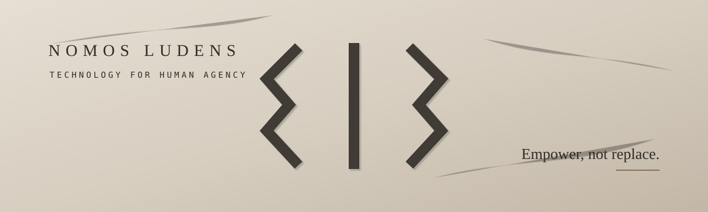

  

# Nomos Ludens

### Technology for human agency.

**Empower, not replace.**

We build tools that extend what people can create, understand, operate and decide — without hiding where human authority lives.

[Principles](./EMPOWER_NOT_REPLACE.md) · [Kuan](https://github.com/NomosLudens/kuan) · [OmniTreco](https://github.com/NomosLudens/omnitreco-repicable)

---

## What we believe

Technology is most useful when it **increases human capability without making human judgment, authorship or control disappear**.

AI may assist.  
Automation may execute.  
Systems may suggest.

**Human agency must remain legible.**

Our operating constraints are:

- **Human authority** — it should be clear who can decide, approve, reject, override and take responsibility.
- **Capability over substitution** — remove friction before removing understanding.
- **Local-first when possible** — data and computation should stay with the user when centralization adds no real value.
- **Verifiable automation** — automated actions should be bounded, observable and contestable.
- **Reality over simulated success** — plausible output, green builds and agent reports are not substitutes for proof in the environment that matters.

**[Read the principle →](./EMPOWER_NOT_REPLACE.md)**

---

## Featured work

<table>
<tr>
<td width="50%" valign="top">

### Kuan

**Automation can assist. The Guardian decides.**

Kuan supports commercial operations such as customer service, scheduling, quotes and payment flows with AI-assisted automation while keeping final human authority explicit.

**[Explore Kuan →](https://github.com/NomosLudens/kuan)**

</td>
<td width="50%" valign="top">

### OmniTreco

**Seu navegador ganhou poderes.**

A local-first, browser-first multi-tool that turns files, sensors and nearby devices into capabilities in the user's hands.

> **If the browser can do it, the server does not touch the file.**

**[Explore OmniTreco →](https://github.com/NomosLudens/omnitreco-repicable)**

</td>
</tr>
</table>

---

## Public repository states

Our public repositories do not all represent the same operational state.

Some are **canonical public products**.  
Some are **sanitized or replicable distributions**.  
Some are **public snapshots of larger private systems**.

We make that distinction explicit because **provenance and operational reality matter**.

---

### Nomos Ludens

**Technology should increase agency before it increases dependence.**

