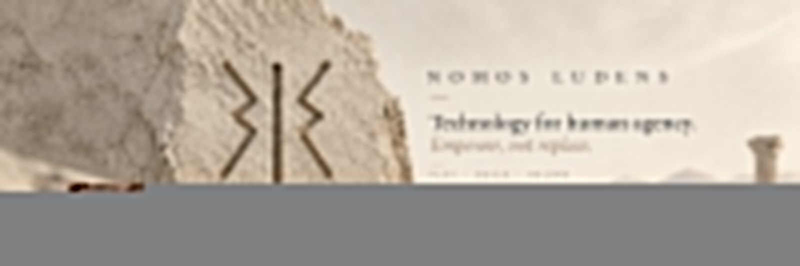

  

# Nomos Ludens

### Technology for human agency.

**Empower, not replace.**

Open tools for a more human internet.

[Principles](./EMPOWER_NOT_REPLACE.md) · [Kuan](https://github.com/NomosLudens/kuan) · [OmniTreco](https://github.com/NomosLudens/omnitreco-repicable)

---

## What we believe

Technology should expand human capability without making human judgment, authorship or control disappear.

AI may assist.  
Automation may execute.  
Systems may suggest.

**Human agency must remain legible.**

---

## Featured work

### Kuan

**Automation can assist. The Guardian decides.**

Kuan supports commercial operations with AI-assisted automation while keeping final human authority explicit.

[Explore Kuan →](https://github.com/NomosLudens/kuan)

---

### OmniTreco

**Seu navegador ganhou poderes.**

A local-first, browser-first multi-tool that turns files, sensors and nearby devices into capabilities in the user's hands.

> If the browser can do it, the server does not touch the file.

[Explore OmniTreco →](https://github.com/NomosLudens/omnitreco-repicable)

---

## Principles in practice

- **Human authority** — it should be clear who decides, approves, rejects and overrides.
- **Capability over substitution** — remove friction before removing understanding.
- **Local-first when possible** — keep computation and data with the user when centralization adds no real value.
- **Verifiable automation** — automated actions should be bounded, observable and contestable.
- **Reality over simulated success** — plausible output is not proof.

---

<strong>Public repository states</strong>

Some public repositories are canonical products.  
Some are sanitized or replicable distributions.  
Some are public snapshots of larger private systems.

We make that distinction explicit because provenance and operational reality matter.

---

**Nomos Ludens**  
Technology should increase agency before it increases dependence.

