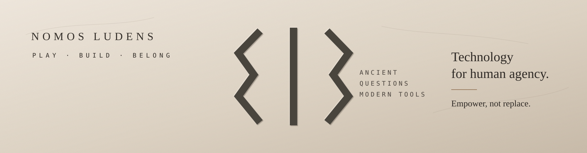

  

# Nomos Ludens

### Tecnologia para a agência humana.

**Empower, not replace.**

Ferramentas abertas para uma internet mais humana.

[Princípios](./EMPOWER_NOT_REPLACE.md) · [Kuan](https://github.com/NomosLudens/kuan) · [OmniTreco](https://github.com/NomosLudens/omnitreco-repicable)

---

## No que acreditamos

A tecnologia deve ampliar a capacidade humana sem fazer desaparecer o julgamento, a autoria ou o controle humanos.

A IA pode assistir.  
A automação pode executar.  
Os sistemas podem sugerir.

**A agência humana deve permanecer legível.**

---

## Projetos em destaque

### Kuan

**A automação pode assistir. O Guardião decide.**

Kuan apoia operações comerciais com automação assistida por IA, mantendo explícita a autoridade humana final.

[Conheça o Kuan →](https://github.com/NomosLudens/kuan)

---

### OmniTreco

**Seu navegador ganhou poderes.**

Um multi-tool local-first e browser-first que transforma arquivos, sensores e dispositivos próximos em capacidades nas mãos do usuário.

> Se o navegador consegue fazer, o servidor não toca no arquivo.

[Conheça o OmniTreco →](https://github.com/NomosLudens/omnitreco-repicable)

---

## Princípios na prática

- **Autoridade humana** — deve estar claro quem decide, aprova, rejeita e pode intervir.
- **Capacidade acima de substituição** — remover atrito antes de remover compreensão.
- **Local-first quando possível** — manter dados e computação com o usuário quando a centralização não agrega valor real.
- **Automação verificável** — ações automatizadas devem ser delimitadas, observáveis e contestáveis.
- **Realidade acima do sucesso simulado** — saída plausível não é prova de funcionamento.

---

<strong>Estados dos repositórios públicos</strong>

Alguns repositórios públicos são produtos canônicos.  
Alguns são distribuições sanitizadas ou replicáveis.  
Alguns são snapshots públicos de sistemas privados maiores.

Tornamos essa distinção explícita porque proveniência e realidade operacional importam.

---

**Nomos Ludens**  
A tecnologia deve aumentar a agência antes de aumentar a dependência.

